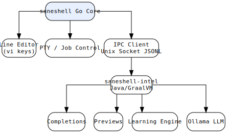

# saneshell

> A next-generation shell that learns from you — proactive completions, inline previews, and post-hoc error detection.

[](https://golang.org)
[](https://openjdk.org)
[](https://www.graalvm.org)
[](internal/ipc/protocol.go)
[](LICENSE)

---

## Architecture



<details>
<summary>ASCII art (for terminal viewing)</summary>

```
┌─────────────────────────────────────────────────────────────┐
│                        saneshell (Go)                       │
│  ┌─────────────┐  ┌─────────────┐  ┌─────────────────────┐  │
│  │ Line Editor │  │  PTY/Job    │  │ IPC Client (Unix    │  │
│  │  (vi keys)  │  │  Control    │  │  Socket JSONL)      │  │
│  └──────┬──────┘  └──────┬──────┘  └──────────┬──────────┘  │
└─────────┼────────────────┼─────────────────────┼─────────────┘
          │                │                     │
          ▼                ▼                     ▼
   ┌──────────────┐ ┌─────────────┐      ┌──────────────────┐
   │  Commands    │ │ Interactive │      │ saneshell-intel  │
   │  (ls, cd,    │ │ (vim, less, │      │  (Java/GraalVM)  │
   │   git, ...)  │ │  top, ...)  │      │                  │
   └──────────────┘ └─────────────┘      │  • Completions   │
                                          │  • Previews      │
                                          │  • Learning      │
                                          │  • Ollama LLM    │
                                          └──────────────────┘
```
</details>

---

## Features

| Feature | Status | Description |
|---------|--------|-------------|
| Line editor (vi keys) | ✅ | History, tab completion, ghost text, vi normal/insert mode |
| `cd`/`pushd`/`popd` builtins | ✅ | Native, directory stack for pushd/popd |
| PTY passthrough | ✅ | vim, less, top work natively |
| Native completions | ✅ | PATH commands + filesystem |
| IPC protocol | ✅ | JSONL over Unix socket |
| Intelligence daemon | 🚧 | Java/GraalVM (completions, preview, learn) |
| Pre-check (⏎⏎) | 📋 | Inline risk analysis before execute |
| Post-hoc fix | 📋 | Learns from errors via Ollama |

---

## Quick Start

```bash
# Build (requires Go 1.22+, Gradle/GraalVM optional for intel daemon)
make build-go

# Run
./dist/saneshell

# With intel daemon (separate terminal):
make build-java
./dist/saneshell-intel
```

> **Version:** `0.1.0`

---

## Makefile Targets

| Target | Description |
|--------|-------------|
| `build-go` | Build the Go shell binary (`dist/saneshell`) |
| `build-java` | Build the Intel daemon (GraalVM native-image or shadow JAR) |
| `build` | Build both Go and Java components |
| `test-go` | Run all Go unit tests across all packages |
| `test-integration` | Run PTY-based integration tests (requires `/dev/pts`) |
| `update-baseline` | Regenerate golden test fixtures from `/bin/bash` |
| `verify` | Full CI gate: `build-go` + unit tests + integration tests |
| `test` | Run all tests (Go + Java) |
| `clean` | Remove build artifacts |
| `install` | Install to `/usr/local` |
| `package` | Build `.deb` package |
| `tag` | Git tag the current version |

---

## System Assumptions

saneshell is designed for **Linux** and relies heavily on:

- **PTY support** (`/dev/pts`) — interactive commands (vim, less, top) and the integration test suite require a working pseudo-terminal. The tests check for PTY availability and skip with a clear message if absent.
- **`/bin/bash`** — command execution delegates to the system shell via `bash -c <cmd>`. Golden test baselines are generated from `/bin/bash`.
- **Unix domain sockets** — the optional Intel daemon communicates over a JSONL Unix socket (`/tmp/saneshell-$UID.sock`).

Windows and macOS are **not** supported targets (though macOS may work with some limitations).

### Tested Environment

| Component | Version |
|-----------|---------|
| OS | LMDE 7 (Linux Mint Debian Edition, "gigi") |
| Kernel | Linux 6.12 x86_64 |
| Go | 1.22.5 |
| Shell (for PTY tests) | /bin/bash |

---

## Requirements

| Tool | Version | Purpose |
|------|---------|---------|
| Go | 1.22+ | Core shell binary |
| Gradle | 8.5+ | Java daemon build (optional) |
| GraalVM | 23.1+ (Java 21) | Native-image compilation (optional) |
| glibc-devel / zlib-devel | — | Static linking for native-image (optional) |
| Ollama | 0.30+ | Optional LLM backend |

---

## Configuration

`~/.config/saneshell/config.toml`:

```toml
[editor]
mode = "vi"          # "vi" or "emacs"
prompt = "\033[32m{{.User}}@\033[36m{{.Host}}:\033[34m{{.CWD}}\033[32m$ \033[0m"
ghost_color = "\033[90m"

[intel]
enabled = false
socket_path = ""     # default: /tmp/saneshell-$UID.sock
timeout_ms = 5000
```

---

## Test Infrastructure

### Golden File Baselines

`testdata/bash-output/` contains expected output for deterministic commands captured from `/bin/bash` running in a PTY. These golden files document the exact behavior bash produces and serve as the contract for saneshell's output.

| File | Source command | Size |
|------|----------------|------|
| `echo-hello.stdout` | `echo hello` | 7 bytes |
| `printf-multiline.stdout` | `printf 'line1\nline2\n'` | 14 bytes |
| `clear.stdout` | `clear` | 11 bytes (escape sequences) |
| `true.stdout` | `true` | 0 bytes (no output) |
| `false.stdout` | `false` | 0 bytes (no output) |
| `sleep-short.stdout` | `sleep 0.01` | 0 bytes (no output) |

Regenerate with `make update-baseline`. If bash behaviour changes (e.g., a new OS version ships different `clear` sequences), this command updates the golden files so the project's expectations match reality.

### Unit Tests (`internal/*/`)

- **`internal/pty/pty_test.go`** — tests `ExecPipe` (the non-PTY fallback path) for basic command execution and exit codes.
- **`internal/editor/editor_test.go`** — tests `visibleWidth` and cursor position calculations with ANSI escapes, multi-byte UTF-8, wide CJK, and emoji.

### PTY Integration Tests (`cmd/saneshell/saneshell_test.go`)

These require a working pseudo-terminal. They:

1. Spawn saneshell in a PTY, send commands, and verify output matches bash golden files.
2. Send two commands back-to-back to verify no extra keystroke is needed (extra-Enter regression test).
3. Measure `ExecPTY` latency (fast commands should return within 500ms).

All PTY tests skip gracefully (exit code 77) when no PTY is available.

---

## Related

- **sanityshell** — Python REPL wrapper (stable, in `../sanityshell/`)
- Protocol spec — `internal/ipc/protocol.go`

---

## License

MIT
